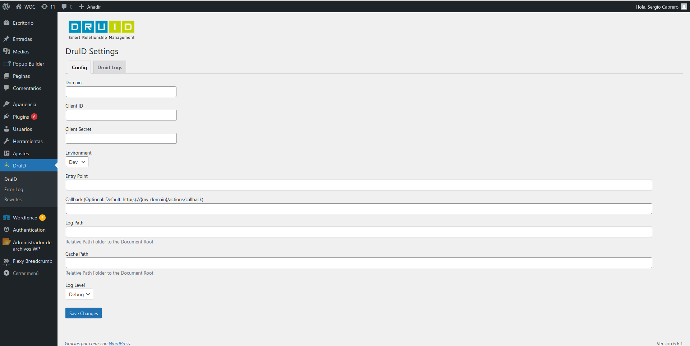
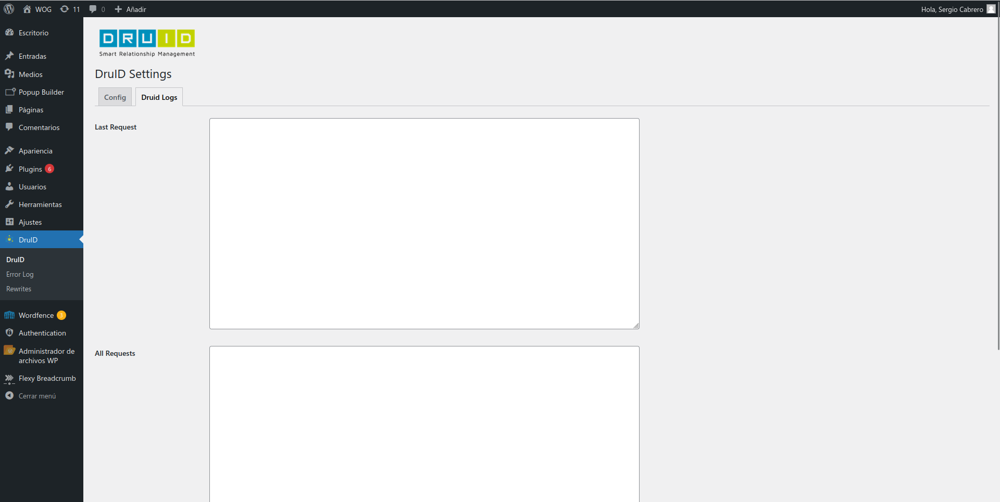

# Plugin DruID para WordPress

Este plugin permite la integración de DruID Identity con WordPress, facilitando la autenticación y el registro de usuarios mediante los servicios de DruID.

## Instalación

1. **Obtener el plugin**  
   Descargue el plugin como archivo ZIP desde el repositorio de GitHub.

2. **Instalar el plugin**  
   En el panel de administración de WordPress, diríjase a la sección `Plugins -> Añadir nuevo plugin -> Subir plugin`, seleccione el archivo ZIP descargado y haga clic en `Instalar Ahora`.

3. **Activar el plugin**  
   Una vez instalado, active el plugin. Tras la activación, aparecerá una pantalla de configuración con dos secciones principales: Configuración y Logs.

## Configuración del Plugin

Debe obtenerse cierta información del Cockpit de DruID identity para configurar el plugin y conseguir así un correcto funcionamiento.

### Configuración de los Campos



1. **Domain**  
   El dominio en el que está instalada la plataforma DruID, necesario para las redireccionar a DruID.

2. **Client ID**  
   Este campo corresponde al ID de App que se genera en la plataforma Dru-ID. Se obtiene del Cockpit y es requerido para que el plugin funcione correctamente.

3. **Client Secret**  
   Es la clave secreta asociada a tu **Client ID**. Al igual que el Client ID, este valor se obtiene del Cockpit de DruID.

4. **Environment**  
   Seleccione el entorno en el que trabajará el plugin (producción, desarrollo, etc.).

5. **Entrypoint**  
   Punto de entrada por defecto de la instalación de DruID. Este valor puede ser sobreescrito en los enlaces individuales de login, registro, etc.

6. **Log Path**  
   Ruta relativa al `Document Root` donde se almacenarán los logs del plugin.

7. **Cache Path**  
   Ruta relativa al `Document Root` donde se almacenará la caché del plugin.

8. **Log Level**  
   Nivel de trazas que se imprimirán, tanto en la sección de logs como en las tablas `wp_druid_error_logs` y `wp_druid_log`.

## Logs del Plugin

El plugin ofrece una sección de Logs donde se puede consultar la interacción entre WordPress y DruID.



1. **Last Request**  
   Muestra las últimas llamadas realizadas entre el plugin y DruID.

2. **All Request**  
   Muestra todas las llamadas registradas desde la instalación del plugin entre WordPress y DruID.

## Uso del Plugin

El plugin funciona mediante **Shortcodes**, los cuales permiten inyectar los enlaces de login, registro, edición de cuenta y logout de DruID directamente en las páginas del sitio web de WordPress.

### Shortcodes Disponibles

1. **[druid_auth_controls]**  
   Este shortcode se utiliza para mostrar los controles de autenticación de DruID, y es ideal para colocar en la cabecera del sitio web. Dependiendo del estado de autenticación del usuario, muestra enlaces de login y registro (si el usuario no está autenticado) o enlaces de área privada y logout (si el usuario está autenticado).

   **Parámetros:**
     - `entrypoint`: Define el punto de entrada de DruID a utilizar (opcional).
     - `urlToRedirect`: URL a la que redirigir después del registro (opcional).
     - `state`: Estado para mantener después del registro (opcional).
     - `show_login`: Define si se debe mostrar el enlace de inicio de sesión. Valor por defecto: `true`.
     - `show_register`: Define si se debe mostrar el enlace de registro. Valor por defecto: `true`.
     - `get_only_url`: Devuelve únicamente la URL de login o de registro, para su uso en enlaces HTML (`login` o `register`).
   
   **Clases CSS:**
     - `druid-auth-controls`: Clase principal del contenedor de los controles de autenticación.
     - `druid-auth-username`: Clase para mostrar el nombre de usuario.
     - `druid-auth-control-link`: Clase base para los enlaces de control.
     - `druid-edit-account`: Clase específica para el enlace de edición de cuenta.
     - `druid-logout`: Clase específica para el enlace de cierre de sesión.
     - `druid-login`: Clase específica para el enlace de inicio de sesión.
     - `druid-register`: Clase específica para el enlace de registro.
   
   **Ejemplo de Uso:**
   ```shortcode
   [druid_auth_controls entrypoint="XXXXXXXXXXXXX-default"]

2. **[druid_auth_controls_login]**  
   Este shortcode genera un enlace de inicio de sesión con DruID. Puedes colocarlo en cualquier parte del sitio web para ofrecer opciones de inicio de sesión a los usuarios.

   **Parámetros:**
     - `entrypoint`: Define el punto de entrada de DruID a utilizar (opcional).
     - `text`: Define el texto del enlace de inicio de sesión. Valor por defecto: `Login`.
     - `urlToRedirect`: URL completa a la que redirigir después del inicio de sesión (opcional).
     - `state`: Estado para mantener después del inicio de sesión (opcional).
   
   **Clases CSS:**
     - `druid-auth-controls-login`: Clase principal del contenedor del enlace de inicio de sesión.
     - `druid-auth-control-link`: Clase base para el enlace de control.
     - `druid-login`: Clase específica para el enlace de inicio de sesión.
   
   **Ejemplo de Uso:**
   ```shortcode
   [druid_auth_controls_login text="Iniciar sesión"]
   
3. **[druid_auth_controls_register]**  
   Este shortcode genera un enlace de registro con DruID. Puedes colocarlo en cualquier parte del sitio web para ofrecer opciones de registro a los usuarios.

   **Parámetros:**
     - `entrypoint`: Define el punto de entrada de DruID a utilizar (opcional).
     - `text`: Define el texto del enlace de registro. Valor por defecto: `Register`.
     - `urlToRedirect`: URL completa a la que redirigir después del registro (opcional).
     - `state`: Estado para mantener después del registro (opcional).
   
   **Clases CSS:**
     - `druid-auth-controls-register`: Clase principal del contenedor del enlace de registro.
     - `druid-auth-control-link`: Clase base para el enlace de control.
     - `druid-register`: Clase específica para el enlace de registro.
   
   **Ejemplo de Uso:**
   ```shortcode
   [druid_auth_controls_register text="Registrarse"]

4. **[druid_auth_controls_edit_account]**  
   Este shortcode genera un enlace para que el usuario acceda a la edición de su cuenta en DruID. Puedes colocarlo en cualquier parte del sitio web para que los usuarios puedan actualizar sus datos de cuenta.

   **Parámetros:**
     - `entrypoint`: Define el punto de entrada de DruID a utilizar (opcional).
     - `text`: Define el texto del enlace para editar la cuenta. Valor por defecto: `Mi Cuenta`.
     - `urlToRedirect`: URL completa a la que redirigir después de editar la cuenta (opcional).
     - `state`: Estado para mantener después de editar la cuenta (opcional).
   
   **Clases CSS:**
     - `druid-auth-controls-edit-account`: Clase principal del contenedor del enlace para editar la cuenta.
     - `druid-auth-control-link`: Clase base para el enlace de control.
     - `druid-edit-account`: Clase específica para el enlace de edición de cuenta.
   
   **Ejemplo de Uso:**
   ```shortcode
   [druid_auth_controls_edit_account text="Mi Cuenta"]
   
5. **[druid_auth_controls_logout]**  
   Este shortcode genera un enlace para cerrar sesión en DruID. Puedes colocarlo en cualquier parte del sitio web para permitir a los usuarios cerrar sesión.

   **Parámetros:**
     - `text`: El texto que se mostrará en el enlace de cierre de sesión. Valor por defecto: `Logout`.

   **Clases CSS:**
     - `druid-auth-controls-logout`: Clase principal del contenedor del enlace de cierre de sesión.
     - `druid-auth-control-link`: Clase base para el enlace de control.
     - `druid-logout`: Clase específica para el enlace de cierre de sesión.
   
   **Ejemplo de Uso:**
   ```shortcode
   [druid_auth_controls_logout text="Cerrar sesión"]