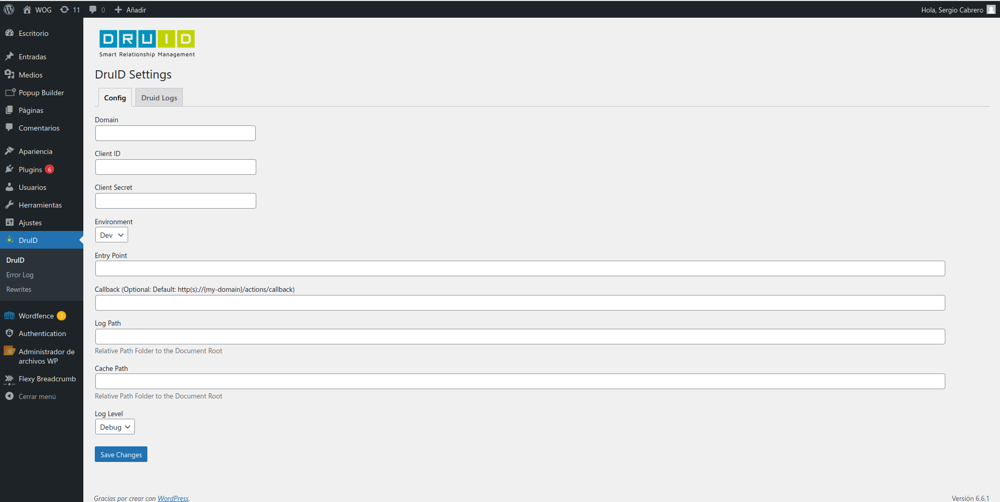
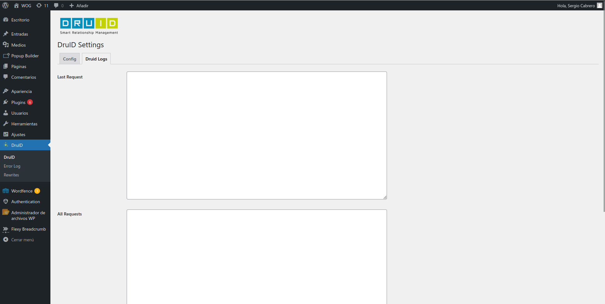

# Plugin DruID para WordPress

Este plugin integra DruID Identity en WordPress para autenticación, registro, edición de cuenta y logout mediante OAuth2.

## Instalación

1. Empaquete o descargue el plugin como ZIP.
2. En WordPress vaya a `Plugins -> Añadir nuevo -> Subir plugin`.
3. Instale y active el plugin.
4. Tras activarlo, acceda al menú `DruID` del admin para completar la configuración.

### Comportamiento de instalación

- En la activación el plugin prepara o actualiza su persistencia interna.
- En la desactivación no se borra la configuración ni los logs.
- En la desinstalación se elimina la información interna generada por el plugin.

## Configuración del plugin

La configuración se gestiona desde `DruID -> Config`.



### Campos disponibles

1. `Domain`
   Dominio de la plataforma DruID. Se utiliza en la configuración del SDK.

2. `Client ID`
   Identificador de cliente de la app en DruID.

3. `Client Secret`
   Secreto asociado al `Client ID`.

4. `Environment`
   Entorno de DruID. Los valores soportados por la interfaz actual son:
   - `dev`
   - `test`
   - `prod`

5. `Entry Point`
   Punto de entrada por defecto. Puede sobreescribirse en los shortcodes.

6. `Log Path`
   Ruta relativa al `Document Root` donde el SDK escribe los logs de fichero.

7. `Cache Path`
   Ruta relativa al `Document Root` donde el SDK almacena la caché.

8. `Log Level`
   Nivel de log del SDK y del registro de errores del plugin. Los valores soportados por la interfaz actual son:
   - `DEBUG`
   - `ERROR`
   - `OFF`

### Rutas relevantes

- Callback OAuth del plugin: `home_url('/actions/callback')`

La URL de callback a registrar en DruID debe apuntar a la URL completa generada por `home_url('/actions/callback')`.

## Pantallas de administración

### `DruID -> Config`

Pantalla principal de configuración del plugin.

### `DruID -> Druid Logs`

Pestaña dentro de la pantalla principal que muestra la traza técnica disponible del SDK cuando el logging está configurado.



### `DruID -> Error Log`

Submenú independiente que muestra los errores funcionales registrados por el plugin.

Esta pantalla muestra:

- fecha (`logged_at`)
- sección
- código de error
- mensaje

## Uso del plugin

El plugin expone shortcodes para mostrar enlaces o bloques de autenticación.

### `[druid_auth_controls]`

Renderiza un bloque combinado de login/registro o de cuenta/logout según el estado del usuario en DruID.

Parámetros:

- `entrypoint`: entry point a utilizar.
- `social`: proveedor social a utilizar en login, si aplica.
- `url-to-redirect`: URL a la que volver tras el flujo.
- `state`: estado adicional a preservar.
- `show_login`: `true` o `false`. Por defecto `true`.
- `show_register`: `true` o `false`. Por defecto `true`.
- `get_only_url`: devuelve solo la URL de `login` o `register`.

Clases CSS:

- `druid-auth-controls`
- `druid-auth-username`
- `druid-auth-control-link`
- `druid-edit-account`
- `druid-logout`
- `druid-login`
- `druid-register`

Ejemplo:

```shortcode
[druid_auth_controls entrypoint="XXXXXXXXXXXXX-default"]
```

### `[druid_auth_controls_login]`

Renderiza un enlace de login.

Parámetros:

- `entrypoint`: entry point a utilizar.
- `social`: proveedor social a utilizar, si aplica.
- `text`: texto del enlace. Por defecto `Login`.
- `url-to-redirect`: URL a la que volver tras el login.
- `state`: estado adicional a preservar.

Clases CSS:

- `druid-auth-controls-login`
- `druid-auth-control-link`
- `druid-login`

Ejemplo:

```shortcode
[druid_auth_controls_login text="Iniciar sesión"]
```

### `[druid_auth_controls_register]`

Renderiza un enlace de registro.

Parámetros:

- `entrypoint`: entry point a utilizar.
- `text`: texto del enlace. Por defecto `Register`.
- `url-to-redirect`: URL a la que volver tras el registro.
- `state`: estado adicional a preservar.

Clases CSS:

- `druid-auth-controls-register`
- `druid-auth-control-link`
- `druid-register`

Ejemplo:

```shortcode
[druid_auth_controls_register text="Registrarse"]
```

### `[druid_auth_controls_edit_account]`

Renderiza un enlace a la edición de cuenta en DruID.

Parámetros:

- `entrypoint`: entry point a utilizar.
- `text`: texto del enlace. Por defecto `My account`.
- `url-to-redirect`: URL a la que volver tras editar la cuenta.
- `state`: estado adicional a preservar.

Clases CSS:

- `druid-auth-controls-edit-account`
- `druid-auth-control-link`
- `druid-edit-account`

Ejemplo:

```shortcode
[druid_auth_controls_edit_account text="Mi cuenta"]
```

### `[druid_auth_controls_logout]`

Renderiza un enlace de logout del plugin.

Parámetros:

- `text`: texto del enlace. Por defecto `Logout`.

Clases CSS:

- `druid-auth-controls-logout`
- `druid-auth-control-link`
- `druid-logout`

Ejemplo:

```shortcode
[druid_auth_controls_logout text="Cerrar sesión"]
```

## Notas de funcionamiento

- El plugin utiliza la sesión de DruID para construir los enlaces y sincronizar el estado del usuario.
- Los shortcodes no generan enlaces si la configuración básica del plugin está incompleta.
- Los errores funcionales del plugin quedan disponibles desde la pantalla `DruID -> Error Log`.
